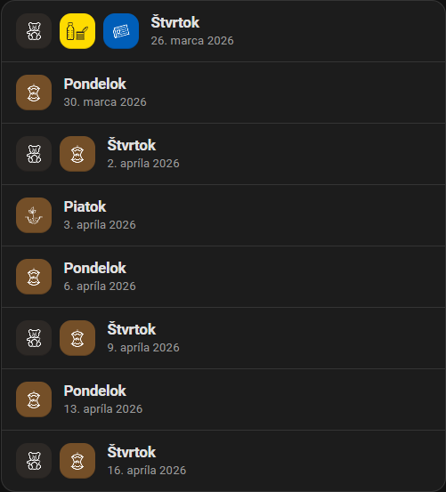

# Unofficial OLO Bratislava Add-on For Home Assistant

Unofficial Home Assistant add-on and companion Lovelace card for showing upcoming OLO Bratislava waste collection dates by category.

## UI Preview

Compact next-pickup card:


Expanded upcoming-pickups card:



## Repository layout

- `repository.yaml` - Home Assistant add-on repository metadata
- `olo_bratislava/` - Home Assistant add-on
- `lovelace-card/` - companion custom card

## Install In Home Assistant

### 1. Add the repository

Add this GitHub repository to Home Assistant as a local add-on repository:

```text
https://github.com/votrelec/ha-olo-bratislava-addon
```

### 2. Install the add-on

Open the add-on store, find `OLO Bratislava`, install it and start it.

Recommended first-run settings:

- `source_url`: `https://www.olo.sk/odpad/zistite-si-svoj-odvozovy-den`
- `registration_number`: your OLO registration number
- choose which waste categories should be shown
- optionally enable persistent and mobile notifications

### 3. Add the Lovelace card resource

Copy [lovelace-card/olo-next-pickup-card.js](./lovelace-card/olo-next-pickup-card.js) into your Home Assistant `www` folder, for example:

```text
/config/www/olo-bratislava/olo-next-pickup-card.js
```

Then add the Lovelace resource:

```text
/local/olo-bratislava/olo-next-pickup-card.js
```

### 4. Add the cards to a dashboard

Compact next-pickup card:

```yaml
type: custom:olo-next-pickup-card
entity: sensor.olo_next_pickup
```

Expanded upcoming-pickups card:

```yaml
type: custom:olo-upcoming-pickups-card
entity: sensor.olo_next_pickup
limit: 8
```

## Local development

This repository is intentionally light on dependencies:

- the add-on backend runs on Node.js with built-in APIs
- the ingress UI is plain HTML/CSS/JS
- the Lovelace card is a plain custom element
- tests use the built-in Node test runner

Run the backend tests locally with:

```powershell
node --experimental-strip-types olo_bratislava/src/schedule.test.ts
```

## Notes

- This project is unofficial and is not affiliated with OLO.
- No Home Assistant instance-specific secrets or deployment artifacts are required for the published repository.
